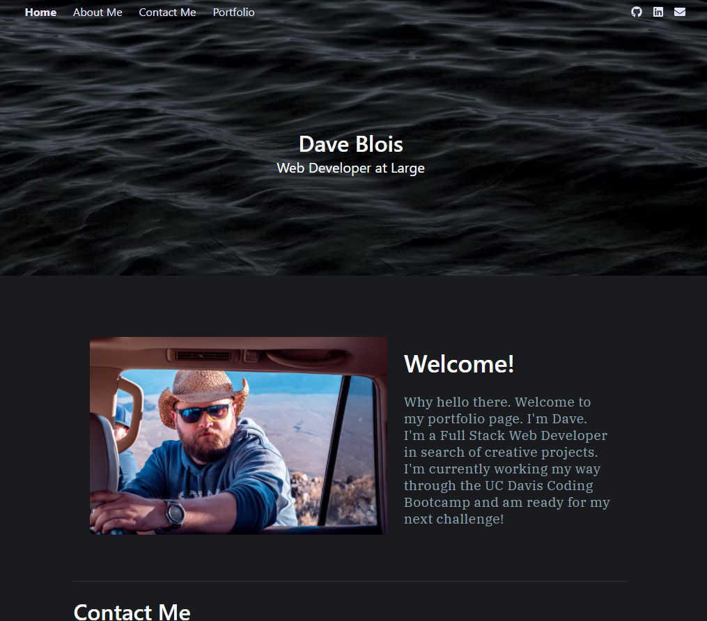

# The Portfolio Assignment

Hello again.
This is the second version of my portfolio.
This time instead of using plain old CSS I made use of the Bulma library and just modified the color scheme.

## Here it is on a standard monitor/laptop

## Technologies Used
Bulma.io as a styling library, other than that, just good old fashioned HTML and CSS.

## Link to live demo
[My Portfolio](https://davebloisesquire.github.io/Portfolio-revamp-1/)

## Uses MIT License
